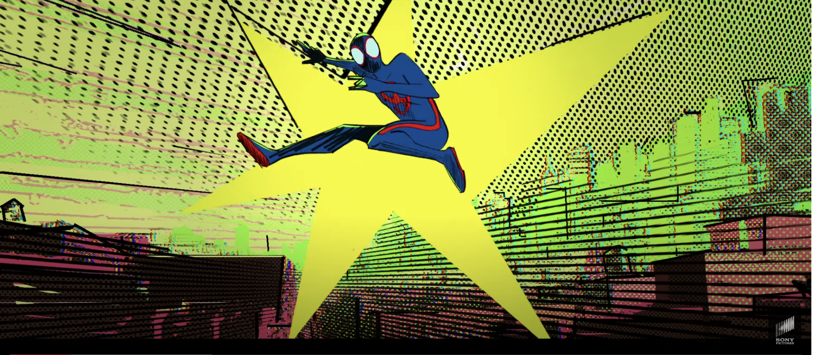

# hcai8120_9103_TUT2

# Part 1: Imaging Technique Inspiration
My inspiration comes from the use of Pop Art in the movie "Spider-Man: Across the Spider-Verse." 
1. Dot matrix effect: This effect makes the image appear as if it's composed of small dots, which in turn form larger patterns and shapes.

2. Glitch effect: images are manipulated using pixel art techniques and bold colors through distortions, inversions, blurring, etc., to create a distinct effect.
I believe adding these effects can boost my project's interactivity and visual appeal. Using user interaction (e.g., mouse) to trigger effects like glitch and creating automatic animations for visuals like the dot matrix will enhance engagement.

# Part 2: Coding Technique Exploration