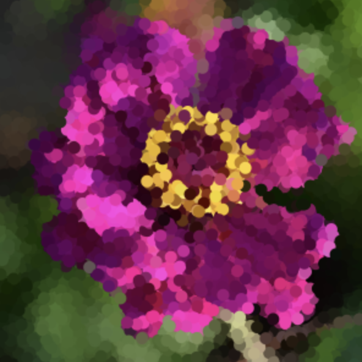

# hcai8120_9103_TUT2
# quiz 8

# Part 1: Imaging Technique Inspiration
My inspiration comes from the use of Pop Art in the movie "Spider-Man: Across the Spider-Verse." 
1. Dot matrix effect: This effect makes the image appear as if it's composed of small dots, which in turn form larger patterns and shapes.

2. Glitch effect: images are manipulated using pixel art techniques and bold colors through distortions, inversions, blurring, etc., to create a distinct effect.
I believe adding these effects can boost my project's interactivity and visual appeal. Using user interaction (e.g., mouse) to trigger effects like glitch and creating automatic animations for visuals like the dot matrix will enhance engagement.

# Part 2: Coding Technique Exploration
1. Data visualization is an area of interest for me. In the link, π is visualized by loading its digits and assigning colors to each digit. Colors can be adjusted and restarted with a keypress, enhancing my project with vibrant glitch effects.
[Link Text](https://happycoding.io/tutorials/p5js/arrays/pi-visualization)

2. img.loadPixels() can help me achieve a Dot matrix effect. Each frame, it randomly selects a pixel from the original image, and then draws a point with the color information of that pixel
[Link Text](https://happycoding.io/tutorials/p5js/images/pixel-painter)

3. getFilterColor() can assist me in calculating new colors for each pixel based on the original colors, resulting in Pop Art with a quirky and bold color effect. 
[Link Text](https://happycoding.io/tutorials/p5js/images/image-filter)

